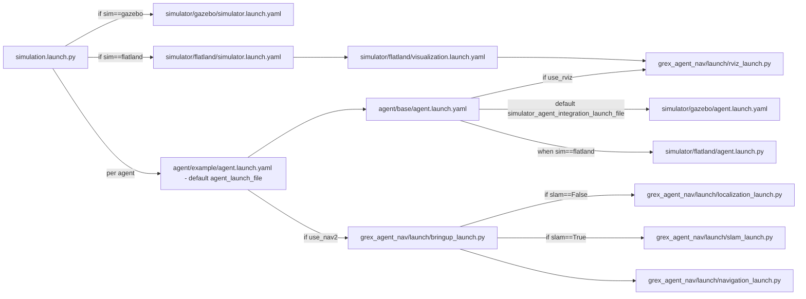

# Grex Functionality (User + Developer Reference)

This document summarizes the functionality currently available in this repository and the launch system that powers it.

## 1) Usage examples (quick start)

```bash
# Default simulation (flatland, one agent)
ros2 launch grex simulation.launch.py

# Three agents on Gazebo
ros2 launch grex simulation.launch.py sim:=gazebo agent_count:=3

# Headless Gazebo
ros2 launch grex simulation.launch.py sim:=gazebo headless:=true

# Show launch arguments for top-level simulation launcher
ros2 launch grex simulation.launch.py -s
```

## 2) Functionality overview

### User-facing functionality

- **Run multi-agent simulations** through `grex/launch/simulation.launch.py`.
- **Choose a simulator**:
  - `flatland` (default)
  - `gazebo` (Gazebo Sim via `ros_gz_sim`)
- **Spawn one or more agents** with configurable start positions.
- **Load a map/world** from `src/grex/models/maps/<map_name>/`.
- **Optional RViz visualization** at both simulator and per-agent levels.
- **Navigation stack integration** (Nav2) through `grex_agent_nav`.
- **Optional SLAM path** for Nav2 bringup.

### Developer-facing functionality

- **Composable launch architecture**:
  - Top-level simulation launcher delegates to simulator launch files and per-agent launch files.
  - Agent launch files can be swapped (`agent_launch_file`) to define custom agent behavior.
- **Simulator integration abstraction**:
  - Agent launch includes simulator-specific integration launch (`simulator_agent_integration_launch_file`).
- **Launch process management service**:
  - `launch_ros_manager_py.actions.LaunchManagementServiceNode` adds a service at
    `/<node_name>/shutdown_namespace` to request shutdown of nodes in a target ROS namespace.

## 3) Simulator descriptions

### Flatland (`sim:=flatland`)

- 2D simulator path:
  - simulator launch: `src/grex/launch/simulator/flatland/simulator.launch.yaml`
  - agent integration launch: `src/grex/launch/simulator/flatland/agent.launch.py`
- Uses:
  - `flatland_server` (`flatland_server` package)
  - model spawn via `ros2 service call /spawn_model flatland_msgs/srv/SpawnModel`
- Includes a dedicated visualization launcher:
  - `src/grex/launch/simulator/flatland/visualization.launch.yaml` (RViz include)

### Gazebo (`sim:=gazebo`)

- Gazebo Sim path:
  - simulator launch: `src/grex/launch/simulator/gazebo/simulator.launch.yaml`
  - agent integration launch: `src/grex/launch/simulator/gazebo/agent.launch.yaml`
- Uses:
  - `ros_gz_sim` launches for simulation server/client and entity spawn
  - `ros_gz_bridge` for topic bridges
  - `ros_gz_image` for camera image bridge
- Supports headless mode by skipping GUI include when `headless:=true`.

## 4) Launch arguments reference

> Defaults below reflect current source values.

### `src/grex/launch/simulation.launch.py`

| Argument | Default | Purpose |
|---|---|---|
| `sim` | `flatland` | Simulator backend selector (`flatland`/`gazebo`). |
| `agent_count` | `1` | Number of agents to launch. |
| `use_agents` | `true` | Enable/disable per-agent launch generation. |
| `use_rviz` | `false` | Propagated to agent launch to enable RViz per agent. |
| `headless` | `false` | Intended simulator headless toggle (consumed by simulator launch files). |
| `map` | `cumberland` | Map name used to derive map/world file paths. |
| `gazebo_world_file` | `$(find-pkg-share grex)/models/maps/$(var map)/model.sdf` | Default Gazebo world path. |
| `flatland_world_file` | `$(find-pkg-share grex)/models/maps/$(var map)/$(var map)_flatland.yaml` | Default Flatland world path. |
| `simulator_launch_file` | `.../launch/simulator/gazebo/simulator.launch.yaml` | Declared simulator launch path argument. |
| `simulator_agent_integration_launch_file` | `.../launch/simulator/gazebo/agent.launch.yaml` | Declared simulator-agent integration launch path argument. |
| `agent_launch_file` | `.../launch/agent/example/agent.launch.yaml` | Per-agent launch file template to include. |

### `src/grex/launch/agent/base/agent.launch.yaml`

| Argument | Default | Purpose |
|---|---|---|
| `id` | `0` | Agent numeric id. |
| `namespace` | `agent$(var id)` | Agent namespace. |
| `model_name` | `waffle` | Robot model name. |
| `urdf_xacro_path` | `.../models/robots/$(var model_name).model.xacro` | Xacro input path. |
| `urdf_path` | `$(dirname)/parsed_$(var namespace).urdf` | Generated URDF output path. |
| `map` | `cumberland` | Map key used for map file path. |
| `map_file` | `.../models/maps/$(var map)/$(var map).yaml` | Nav map yaml path. |
| `initial_pos_x` | `0.0` | Initial X pose. |
| `initial_pos_y` | `0.0` | Initial Y pose. |
| `initial_pos_z` | `0.0` | Initial Z pose. |
| `initial_pos_theta` | `0.0` | Initial yaw pose. |
| `use_nav2` | `true` | Enables Nav2 bringup include. |
| `use_rviz` | `true` | Enables namespaced RViz include. |
| `simulator_agent_integration_launch_file` | `.../launch/simulator/gazebo/agent.launch.yaml` | Simulator-specific agent integration launch path. |
| `urdf_xacro_data` | xacro command substitution | Triggers Xacro->URDF generation side effect. |

### `src/grex/launch/agent/example/agent.launch.yaml`

| Argument | Default | Purpose |
|---|---|---|
| `id` | `0` | Agent numeric id. |
| `namespace` | `agent$(var id)` | Agent namespace. |
| `model_name` | `waffle` | Robot model. |
| `map` | `cumberland` | Map key. |
| `map_file` | `.../models/maps/$(var map)/$(var map).yaml` | Map yaml for Nav2. |
| `initial_pos_x` | `0.0` | Initial X pose. |
| `initial_pos_y` | `0.0` | Initial Y pose. |
| `initial_pos_z` | `0.0` | Initial Z pose. |
| `use_nav2` | `true` | Enables Nav2 include block. |
| `params_file` | `.../grex_agent_nav/params/nav2_params.yaml` | Nav2 parameter file. |

### `src/grex/launch/simulator/gazebo/simulator.launch.yaml`

| Argument | Default | Purpose |
|---|---|---|
| `map` | `cumberland` | Map key. |
| `gazebo_world_file` | `.../models/maps/$(var map)/model.sdf` | Gazebo world path. |
| `headless` | `false` | Skip GUI launch include when true. |

### `src/grex/launch/simulator/gazebo/agent.launch.yaml`

| Argument | Default | Purpose |
|---|---|---|
| `id` | `0` | Agent numeric id. |
| `namespace` | `agent$(var id)` | Agent namespace/entity name. |
| `model_name` | `waffle` | Model selector for URDF file path. |
| `urdf_path` | `.../models/robots/$(var model_name).model` | Robot description file path used for spawn. |
| `initial_pos_x` | `0.0` | Spawn X. |
| `initial_pos_y` | `0.0` | Spawn Y. |
| `initial_pos_z` | `0.0` | Spawn Z. |

### `src/grex/launch/simulator/flatland/simulator.launch.yaml`

| Argument | Default | Purpose |
|---|---|---|
| `map` | `cumberland` | Map key. |
| `flatland_world_file` | `.../models/maps/$(var map)/$(var map)_flatland.yaml` | Flatland world file. |
| `global_frame_id` | `map` | Global frame id value. |
| `update_rate` | `100.0` | Flatland simulation update rate. |
| `step_size` | `0.01` | Flatland simulation step size. |
| `show_viz` | `false` | Flatland built-in visualization toggle. |
| `viz_pub_rate` | `30.0` | Flatland visualization publication rate. |
| `use_sim_time` | `true` | Simulation-time toggle. |
| `laser_topic` | `scan` | Laser topic name. |
| `odom_topic` | `odom` | Odometry topic name. |
| `odom_frame_id` | `odom` | Odometry frame id. |
| `base_frame_id` | `base_link` | Base frame id. |
| `min_obstacle_height` | `0.0` | Min obstacle height default. |
| `max_obstacle_height` | `5.0` | Max obstacle height default. |
| `move_base/local_costmap/obstacle_layer/scan/min_obstacle_height` | `$(var min_obstacle_height)` | Local costmap scan min obstacle override. |
| `move_base/local_costmap/obstacle_layer/scan/max_obstacle_height` | `$(var max_obstacle_height)` | Local costmap scan max obstacle override. |
| `move_base/global_costmap/obstacle_layer/scan/min_obstacle_height` | `$(var min_obstacle_height)` | Global costmap scan min obstacle override. |
| `move_base/global_costmap/obstacle_layer/scan/max_obstacle_height` | `$(var max_obstacle_height)` | Global costmap scan max obstacle override. |

### `src/grex/launch/simulator/flatland/visualization.launch.yaml`

| Argument | Default | Purpose |
|---|---|---|
| `agent_count` | `1` | Declared visualization argument for multi-agent visualization contexts. |

### `src/grex/launch/simulator/flatland/agent.launch.py`

| Argument | Default | Purpose |
|---|---|---|
| `id` | `0` | Agent numeric id. |
| `namespace` | `agent$(var id)` | Agent namespace. |
| `initial_pos_x` | `0.0` | Spawn X. |
| `initial_pos_y` | `0.0` | Spawn Y. |
| `initial_pos_theta` | `0.0` | Spawn heading. |
| `model_file` | `.../models/robots/turtlebot.model.yaml` | Flatland model YAML file. |
| `_odom_frame_concat` | `$(var namespace)/odom` | Internal helper argument for model rewrite. |
| `_map_frame_concat` | `$(var namespace)/map` | Internal helper argument for TF helper transforms. |
| `configured_model_file` | `RewrittenYaml(...)` | Generated temporary model file with namespace/topic rewrites. |

### `grex_agent_nav` (high-level note)

Grex uses `src/grex_agent_nav/launch/bringup_launch.py` as its Nav2 entrypoint from the example agent launch. The other `grex_agent_nav` launch files (`localization_launch.py`, `navigation_launch.py`, `slam_launch.py`, `rviz_launch.py`) are internal pieces composed by that bringup flow.

## 5) Launch File Flow

### Main simulation launch hierarchy


